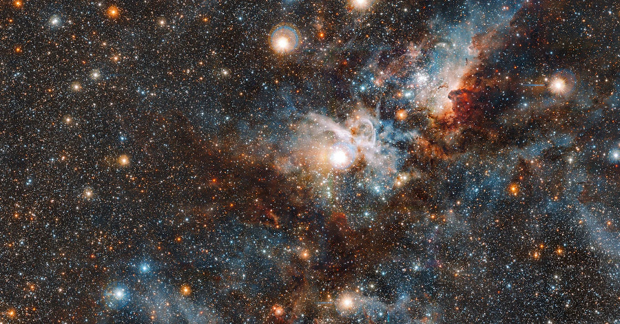

# Algorithms in the cosmodrome

Baikonur is a city in Kazakhstan, under russian administration, where the largest space facility in the world is located. Both Sputnik 1, the first artificial satellite, and Vostok 1, the first human spaceflight, were launched from the Baikonur Cosmododrome.

Baikonur could also be seen as a closed city opened to the universe. It is a closed city because a special authorization is required to visit or leave the city located in the Kazakh steep, it is opened to the universe because its space facilities are still in use nowadays for launches to the International Space Station.

In this course we will have a look at a collection of algorithms that deal with space subdivision, world creation, travel and exploration, picturing our room as our personal space station.

P.S.
The course is focused on algorithms, not on a programming language. A prior knowledge of a creative coding framework is required, you can participate with the creative coding framework you are more familiar with: Processing, openFrameworks, three.js, paper.js, p5.js, nannou, arduino IDE, you name it.

## Introduction
The course is divided in three parts, space subdivision, space exploration and space creation. In each lesson we are going to see one algorithm inherent to the the main topic.

### Space Subdivision

- Random subdivion in squares

- Phyllotaxis

- Poisson disc

- Convex hull

- Quadtree

- Binary search tree

- Voronoi

### Space Exploration

- Random Walker

- Diffuse limited aggregation

- Travelling salesman problem

- 2D Ray casting

- Pathfinding algorithm

### Space Creation

- A simple starfield

- Maze generator

- Sandpiles

- Game of Life

